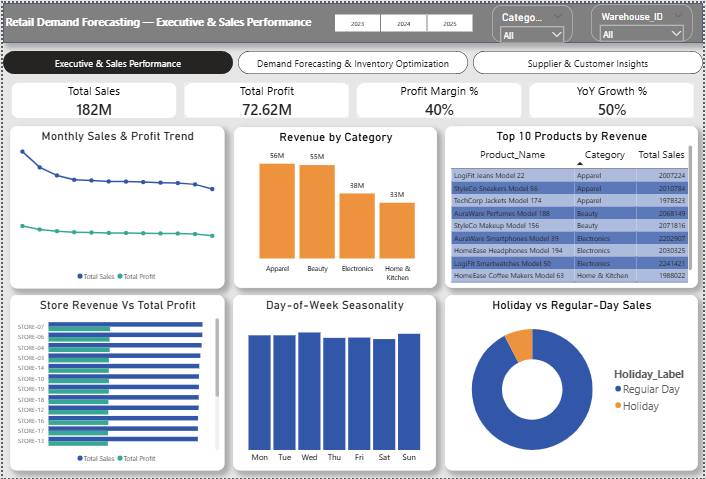
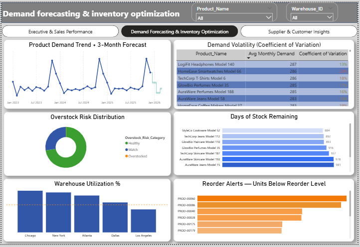
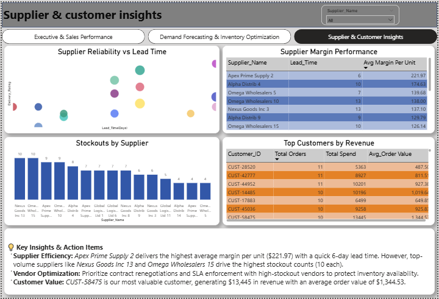

# 🛍️ Retail Demand Forecasting & Inventory Optimization

An end-to-end data analytics and database management solution designed to analyze sales performance, evaluate demand trends, optimize inventory safety stocks, and assess supplier reliability.
---
## 📌 Project Overview

Retail operations require precise demand alignment to prevent **stockouts** and minimize **overstock risks**. This project analyzes multi-table transactional retail data to generate actionable insights for inventory planning, supplier selection, and sales strategy.

### Key Objectives:
- **Exploratory Data Analysis (EDA):** Identify sales velocity, seasonality, and profit drivers using Python.
- **Relational Schema Design:** Build a structured SQL database with data validation constraints.
- **Business Intelligence Queries:** Run window functions, CTEs, and moving averages to evaluate demand volatility and warehouse capacity.
- **Performance Dashboards:** Visualize operational KPIs for strategic decision-making.
---
## 🛠️ Tech Stack & Tools

- **Programming:** Python (`pandas`, `numpy`, `matplotlib`, `seaborn`)
- **Database:** MySQL / SQL
- **Environment:** Jupyter Notebook
- **Version Control:** Git & GitHub
- **Visualization:** Interactive BI / Analytics Dashboard
---
## 🗄️ Database Architecture

The relational schema consists of 6 primary entities linked via primary and foreign key constraints

### Table Summary:
| Table Name | Row Count | Primary Key | Description |
| :--- | :--- | :--- | :--- |
| `suppliers` | 15 | `Supplier_ID` | Supplier lead times & delivery ratings |
| `products` | 200 | `Product_ID` | Product catalog, pricing, and margin data |
| `warehouses` | 5 | `Warehouse_ID` | Facility locations and maximum capacities |
| `calendar` | 1,096 | `Date` | Time-series reference table with holiday flags |
| `inventory` | 1,000 | `Product_ID, Warehouse_ID` | Stock levels, reorder thresholds & safety stocks |
| `sales` | 200,000 | `Order_ID` | Historical transactional sales data |

---

## 📊 Key Analytics & Insights

### 1. Sales & Profit Trends
- **YoY Growth & Pareto Analysis:** Querying top-performing categories to isolate revenue drivers.
- **Holiday & Seasonality Impact:** Comparative analysis showing sales lift on promotional and holiday periods.

### 2. Inventory Risk & Optimization
- **Reorder Level Breaches:** Pinpointing stock keeping units (SKUs) falling below safety stock limits.
- **Stock-Out Projections:** Estimating remaining days of stock based on a trailing 90-day daily demand average.
- **Warehouse Capacity Utilization:** Assessing high-risk facilities operating near maximum thresholds.

### 3. Supplier Performance
- **Lead Time vs. Reliability:** Evaluating delivery ratings against stockout occurrences to optimize supply chain pipelines.

---

## 📈 Dashboard Preview

| Dashboard 1 | Dashboard 2 | Dashboard 3
| :---: | :---: | :---:
|  |  | 

